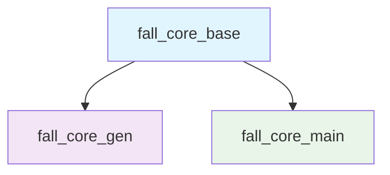

# Fall Core 多模块发布指南

在发布新版本到 pub.dev 之前，请确保完成以下所有检查项。Fall Core 项目采用多模块架构，包含三个独立的包：

- **fall_core_base** - 核心注解和基础工具
- **fall_core_gen** - 代码生成器
- **fall_core_main** - 运行时核心

## 🏗️ 模块架构与发布顺序

由于模块间存在依赖关系，发布必须按以下顺序进行：



**推荐发布顺序**：
1. `fall_core_base` （基础模块，零依赖）
2. `fall_core_gen` （依赖 fall_core_base）
3. `fall_core_main` （依赖 fall_core_base）

## 📋 代码质量检查

对每个模块都要进行以下检查：

### fall_core_base
- [ ] **代码分析通过**: `cd fall_core_base && flutter analyze` 无错误和警告
- [ ] **测试通过**: 所有单元测试通过（如果存在）
- [ ] **零外部依赖**: 确保仅依赖 Flutter SDK 和 meta包
- [ ] **注解完整性**: 所有核心注解完整可用

### fall_core_gen
- [ ] **代码分析通过**: `cd fall_core_gen && flutter analyze` 无错误和警告
- [ ] **测试通过**: 生成器单元测试通过
- [ ] **代码生成测试**: 使用 `dart run build_runner build` 测试生成功能
- [ ] **依赖检查**: build、source_gen 等依赖版本正确

### fall_core_main
- [ ] **代码分析通过**: `cd fall_core_main && flutter analyze` 无错误和警告
- [ ] **测试通过**: AOP和依赖注入测试通过
- [ ] **GetX集成**: 与GetX的集成正常工作
- [ ] **Hook系统**: 所有Hook类型正常工作

### 通用检查
- [ ] **代码格式化**: 使用 `dart format .` 格式化所有代码
- [ ] **依赖检查**: 确保所有依赖版本是最新稳定版本

## 📚 文档检查

### 各模块文档
- [ ] **fall_core_base/README.md**: 核心注解和工具使用说明
- [ ] **fall_core_gen/README.md**: 代码生成器配置和使用指南
- [ ] **fall_core_main/README.md**: AOP和依赖注入功能说明
- [ ] **根目录README.md**: 更新整体架构和快速开始指南

### 版本变更记录
- [ ] **fall_core_base/CHANGELOG.md**: 记录核心注解变更
- [ ] **fall_core_gen/CHANGELOG.md**: 记录生成器变更
- [ ] **fall_core_main/CHANGELOG.md**: 记录运行时功能变更

### API文档
- [ ] **dartdoc注释**: 确保所有公共API都有完整的dartdoc注释
- [ ] **使用示例**: 每个模块都包含详细的使用示例

## 🔧 版本管理

### 版本号管理
- [ ] **版本号同步**: 所有三个模块使用相同的版本号
- [ ] **使用版本同步脚本**: 推荐使用脚本统一更新版本号
  ```bash
  # Linux/macOS
  ./scripts/sync_version.sh
  
  # Windows
  scripts\sync_version.bat
  ```
- [ ] **语义化版本**: 遵循 [Semantic Versioning](https://semver.org/lang/zh-CN/)
  - 主版本号 (X.y.z): 不兼容的 API 修改
  - 次版本号 (x.Y.z): 向下兼容的功能性新增
  - 修订号 (x.y.Z): 向下兼容的问题修正

### pubspec.yaml 检查
对每个模块的 pubspec.yaml 进行检查：

- [ ] **版本号更新**: 在所有模块的 pubspec.yaml 中更新版本号
- [ ] **模块间依赖**: 检查fall_core_gen和fall_core_main对fall_core_base的依赖版本
- [ ] **描述信息**: 每个模块的description准确描述其功能
- [ ] **元数据信息**: homepage、repository、topics 等信息完整

### Git 标签管理
- [ ] **模块标签**: 为每个模块创建对应的Git标签
  - fall_core_base-v1.0.0
  - fall_core_gen-v1.0.0  
  - fall_core_main-v1.0.0

## 🎯 发布信息

- [ ] **描述完整**: pubspec.yaml 中的 description 准确描述包功能
- [ ] **主页链接**: homepage 和 repository 链接正确
- [ ] **话题标签**: topics 包含相关关键词
- [ ] **许可证**: LICENSE 文件存在且适当

## 🧪 功能测试

- [ ] **核心功能**: 所有核心功能正常工作
- [ ] **依赖注入**: @Service 和 @Auto 注解正常工作
- [ ] **AOP 功能**: Hook 系统正常工作
- [ ] **示例应用**: example 应用可以正常构建和运行

## 📦 发布准备

- [ ] **干运行测试**: `dart pub publish --dry-run` 通过
- [ ] **发布权限**: 确保有 pub.dev 发布权限
- [ ] **网络连接**: 确保网络连接稳定

## 🚀 发布后验证

- [ ] **包页面检查**: 在 pub.dev 上检查包页面显示正确
- [ ] **文档渲染**: 确保文档在 pub.dev 上正确渲染
- [ ] **下载测试**: 在新项目中测试包的安装和使用

## 📝 发布命令

### 方式一：使用多模块发布脚本（推荐）
```bash
# Linux/macOS
chmod +x scripts/publish.sh
./scripts/publish.sh

# Windows
scripts\publish.bat
```

**脚本功能**：
- 自动检查所有三个模块的状态
- 按依赖顺序自动发布模块
- 自动创建和推送Git标签
- 发布间隔等待，避免网络问题

### 方式二：手动逐个发布
```bash
# 1. 发布 fall_core_base
cd fall_core_base
flutter clean && flutter pub get
flutter analyze && dart test
dart pub publish --dry-run
dart pub publish
cd ..

# 2. 发布 fall_core_gen
cd fall_core_gen  
flutter clean && flutter pub get
flutter analyze && dart test
dart pub publish --dry-run
dart pub publish
cd ..

# 3. 发布 fall_core_main
cd fall_core_main
flutter clean && flutter pub get
flutter analyze && dart test
dart pub publish --dry-run
dart pub publish
cd ..

# 4. 创建标签
git tag fall_core_base-v1.0.0
git tag fall_core_gen-v1.0.0
git tag fall_core_main-v1.0.0
git push origin --tags
```

### 方式三：单个模块发布
```bash
# 选择性发布某个模块
cd <module_name>
flutter analyze
dart pub publish --dry-run
dart pub publish
```

## 🔄 发布后流程

### 立即验证
1. **检查包页面**: 在 pub.dev 上检查所有三个包的页面显示正确
   - https://pub.dev/packages/fall_core_base
   - https://pub.dev/packages/fall_core_gen
   - https://pub.dev/packages/fall_core_main
2. **文档渲染**: 确保所有模块的文档在 pub.dev 上正确渲染
3. **依赖关系**: 验证模块间依赖关系显示正确

### 功能测试
4. **安装测试**: 在新项目中测试完整框架的安装和使用
```yaml
dependencies:
  fall_core_base: ^1.0.0
  fall_core_main: ^1.0.0

dev_dependencies:
  fall_core_gen: ^1.0.0
  build_runner: ^2.7.0
```

5. **集成测试**: 测试整个框架的功能集成
   - 注解系统正常工作
   - 代码生成器正常运行
   - AOP和依赖注入功能正常

### 后续工作
6. **更新示例项目**: 确保 example 项目使用最新发布的版本
7. **发布公告**: 在相关社区发布新版本公告
8. **监控反馈**: 关注 GitHub Issues 和 pub.dev 评分
9. **性能监控**: 监控下载量和使用情况

---

## ⚠️ 重要注意事项

1. **发布不可撤销**: 发布到 pub.dev 是不可撤销的操作，请确保在发布前完成所有检查项。

2. **模块依赖顺序**: 必须按照 fall_core_base → fall_core_gen → fall_core_main 的顺序发布，否则会导致依赖错误。

3. **版本同步**: 建议所有模块保持相同的版本号，保证兼容性。

4. **网络间隔**: 在发布多个模块时，建议在每个模块之间等待 10-30 秒，避免 pub.dev 的缓存问题。

5. **备份策略**: 发布前建议在干净的 Git 状态下进行，并确保有完整的代码备份。