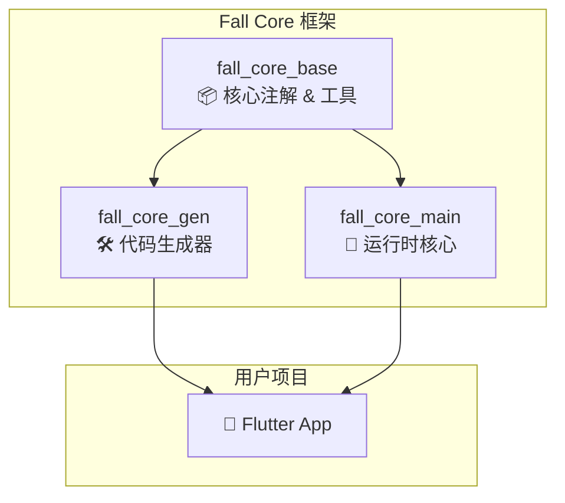

# Fall Core

一个受 Spring 框架启发的 Flutter 企业级开发框架，提供依赖注入（DI）和面向切面编程（AOP）功能。

[](https://pub.dev/packages/fall_core_base)
[](https://opensource.org/licenses/MIT)
[](https://dart.dev/)
[](https://flutter.dev)

## ✨ 特性

- 🏗️ **企业级架构**：受 Spring 框架启发的设计理念
- 💉 **依赖注入**：基于注解的自动依赖注入系统
- 🔄 **面向切面编程**：完整的 AOP 支持，包括 Before、After、Around、Throw Hook
- ⚡ **零运行时开销**：编译时代码生成，无反射调用
- 🎯 **类型安全**：完全类型安全的依赖注入
- 🔧 **模块化设计**：清晰的模块分离和职责划分
- 📦 **轻量级**：核心模块零外部依赖

## 🏛️ 模块架构

Fall Core 采用模块化架构设计，分为三个独立的包：



### 📦 [fall_core_base](./fall_core_base/)
**核心注解和基础工具模块**
- 提供 `@Service`、`@Auto`、`@Aop`、`@NoAop` 等核心注解
- 基础工具类和日志工厂
- 零外部依赖，轻量级设计

### 🛠️ [fall_core_gen](./fall_core_gen/)
**代码生成器模块**
- `ServiceGenerator`：服务注册代码生成
- `AopGenerator`：AOP 代理类生成
- 编译时扫描和代码生成
- 支持 `build_runner` 集成

### 🚀 [fall_core_main](./fall_core_main/)
**运行时核心模块**
- AOP 执行引擎和 Hook 系统
- 依赖注入工具
- GetX 容器集成
- 企业级运行时功能

## ✨ 核心特性

### 🎯 依赖注入 (Dependency Injection)
- **服务注解**: 通过 `@Service` 注解标记服务类
- **自动注入**: 通过 `@Auto` 注解实现属性注入
- **命名注入**: 支持通过名称区分同类型的多个服务实例
- **生命周期管理**: 支持单例和原型模式
- **懒加载**: 按需创建服务实例，优化应用启动性能

### 🔄 面向切面编程 (AOP)
- **Before Hook**: 方法执行前的拦截处理
- **After Hook**: 方法执行后的拦截处理
- **Around Hook**: 环绕通知，完全控制方法执行
- **Throw Hook**: 异常处理和统一错误管理
- **Hook 过滤**: 支持按名称过滤特定的 Hook

### 📝 企业级架构
- **注解驱动**: 类似 Spring 的注解系统
- **异常处理**: 完整的异常拦截和处理机制
- **日志系统**: 内置的日志系统和 Hook 集成
- **轻量级框架**: 简洁的核心实现，无外部依赖

## 🚀 快速开始

### 安装

在你的 `pubspec.yaml` 中添加以下依赖：

```yaml
dependencies:
  # 核心注解和工具
  fall_core_base: ^0.0.1
  # 运行时功能
  fall_core_main: ^0.0.1

dev_dependencies:
  # 代码生成器
  fall_core_gen: ^0.0.1
  build_runner: ^2.7.0
```

然后运行：

```bash
flutter pub get
# 生成代码
flutter pub run build_runner build
```

### 基本使用

#### 1. 定义服务

```dart
import 'package:fall_core/fall_core.dart';

// 基础服务定义
@Service()
class UserService {
  Future<User> getUserById(String id) async {
    // 业务逻辑
  }
}

// 带 AOP 的服务
@Service()
@Aop(allowedHooks: ['logging', 'timing'])
class OrderService {
  Future<Order> createOrder(Order order) async {
    // 业务逻辑
  }

  @NoAop() // 跳过 AOP 处理
  String _generateOrderId() {
    return 'ORDER_${DateTime.now().millisecondsSinceEpoch}';
  }
}

// 命名服务
@Service(name: 'primaryCache')
class CacheService {
  void set(String key, dynamic value) { /* ... */ }
  dynamic get(String key) { /* ... */ }
}
```

#### 2. 依赖注入

```dart
@Service()
class OrderController {
  @Auto() // 自动注入
  late UserService userService;
  
  @Auto(name: 'primaryCache') // 命名注入
  late CacheService cacheService;
  
  Future<void> processOrder(String userId, Order order) async {
    final user = await userService.getUserById(userId);
    cacheService.set('last_order_${userId}', order);
    // 处理订单逻辑
  }
}
```

#### 3. AOP Hook 定义

```dart
// 日志记录 Hook
class LoggingHook implements BeforeHook, AfterHook {
  @override
  String get name => 'logging';
  
  @override
  void onBefore(HookContext context) {
    print('开始执行: ${context.methodName}');
  }
  
  @override
  void onAfter(HookContext context, dynamic result) {
    print('执行完成: ${context.methodName} -> $result');
  }
}

// 性能监控 Hook
class TimingHook implements AroundHook {
  @override
  String get name => 'timing';
  
  @override
  dynamic execute(HookContext context, Function() proceed) {
    final stopwatch = Stopwatch()..start();
    try {
      final result = proceed();
      return result;
    } finally {
      stopwatch.stop();
      print('${context.methodName} 执行耗时: ${stopwatch.elapsedMilliseconds}ms');
    }
  }
}
```

#### 4. 应用初始化

```dart
void main() {
  // 创建服务实例
  final aopService = AopService();

  // 注册 AOP Hooks
  aopService.addBeforeHook(LoggingHook());
  aopService.addAroundHook(TimingHook());

  //结合fall_gen自动生成Aop代码
  //结合fall_gen自动生成auto_scan代码，详见fall_gen说明
  
  runApp(MyApp());
}
```


## 📚 核心概念

### 注解系统

| 注解 | 用途 | 示例 |
|------|------|------|
| `@Service()` | 标记服务类 | `@Service(name: 'userService', lazy: false)` |
| `@Aop()` | 启用 AOP 增强 | `@Aop(allowedHooks: ['logging'])` |
| `@Auto()` | 自动依赖注入 | `@Auto(name: 'primaryCache')` |
| `@NoAop()` | 跳过 AOP 处理 | `@NoAop(reason: '性能敏感方法')` |

### Hook 类型

- **BeforeHook**: 在目标方法执行前调用
- **AfterHook**: 在目标方法执行后调用
- **AroundHook**: 完全包围目标方法的执行
- **ThrowHook**: 在方法抛出异常时调用

### 执行顺序

```
AroundHook.before → BeforeHook → 目标方法 → AfterHook → AroundHook.after
                                    ↓ (异常)
                                ThrowHook
```

## 🏗️ 架构对比

| 特性 | Spring (Java) | Fall Core (Flutter) |
|------|---------------|----------------------|
| 依赖注入 | @Autowired, @Component | @Auto, @Service |
| AOP | @Aspect, @Around | @Aop, AroundHook |
| 配置 | application.yml | pubspec.yaml |
| 容器 | ApplicationContext | 轻量级核心 |

## 📖 示例项目

查看 [example](./example) 目录获取完整的示例项目，包含：

- 完整的服务定义和注入示例
- AOP Hook 的使用演示
- 错误处理和参数验证
- 性能监控和日志记录
- 完整的 Flutter 应用示例

## 🔧 配置

### 自定义配置

```dart
// 自定义服务配置
@Service(
  name: 'customService',
  lazy: false,        // 立即初始化
  singleton: true,    // 单例模式
)
class CustomService { }

// 自定义 AOP 配置
@Aop(
  allowedHooks: ['logging', 'security', 'timing'],
  name: 'secureService'
)
class SecureService { }
```

## 🤝 贡献指南

我们欢迎社区贡献！请查看 [CONTRIBUTING.md](CONTRIBUTING.md) 了解如何参与项目开发。

### 开发环境设置

```bash
# 克隆项目
git clone https://github.com/flutter-fall/fall_core.git
cd fall-core

# 安装依赖
flutter pub get

# 运行示例
cd example
flutter pub get
flutter run
```

## 📄 许可证

本项目采用 [MIT 许可证](LICENSE)。

## 🔗 相关链接

- [API 文档](https://pub.dev/documentation/fall_core)
- [示例项目](./example)
- [更新日志](CHANGELOG.md)
- [问题反馈](https://github.com/flutter-fall/fall_core/issues)

## 🙏 致谢

特别感谢以下项目的启发：

- [Spring Framework](https://spring.io/) - Java 企业级应用框架
- [Injectable](https://github.com/Milad-Akarie/injectable) - Dart 依赖注入代码生成

---

**Fall Core** - 让 Flutter 开发更简单、更优雅、更企业级 🚀