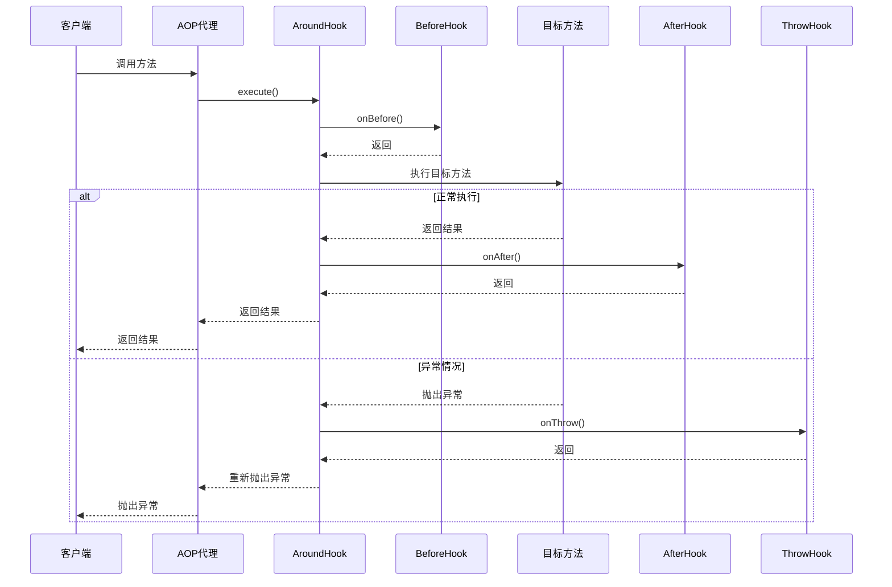

# Fall Core Main

Fall Core 框架的运行时核心模块，提供 AOP 执行引擎和依赖注入工具。

[](https://pub.dev/packages/fall_core_main)
[](https://opensource.org/licenses/MIT)

## 📦 模块介绍

`fall_core_main` 是 Fall Core 框架的运行时核心模块，提供了完整的 AOP（面向切面编程）执行引擎、Hook 系统和依赖注入工具。它与代码生成器协作，为 Flutter 应用提供企业级的架构支持。

## ✨ 特性

- 🎯 **AOP 执行引擎**：完整的面向切面编程运行时支持
- 🪝 **Hook 系统**：Before、After、Around、Throw 四种 Hook 类型
- 💉 **依赖注入工具**：与 GetX 深度集成的注入工具
- 🔍 **上下文传递**：完整的方法调用上下文支持
- ⚡ **高性能**：基于代理模式的高效方法拦截
- 🛡️ **异常处理**：专用的异常切面处理机制
- 📊 **内置日志**：完整的日志切面支持
- 🎛️ **Hook 过滤**：基于白名单的 Hook 过滤机制

## 🪝 Hook 系统

### Hook 类型

#### BeforeHook - 前置通知
在目标方法执行前调用：

```dart
import 'package:fall_core_main/fall_core_main.dart';

class LoggingHook implements BeforeHook {
  @override
  String get name => 'logging';
  
  @override
  void onBefore(HookContext context) {
    print('🚀 开始执行: ${context.targetClassName}.${context.methodName}');
    print('📝 参数: ${context.arguments}');
  }
}
```

#### AfterHook - 后置通知
在目标方法执行后调用：

```dart
class ResultLogHook implements AfterHook {
  @override
  String get name => 'result_logging';
  
  @override
  void onAfter(HookContext context, dynamic result) {
    print('✅ 执行完成: ${context.methodName}');
    print('📊 返回值: $result');
  }
}
```

#### AroundHook - 环绕通知
完全包围目标方法的执行：

```dart
class TimingHook implements AroundHook {
  @override
  String get name => 'timing';
  
  @override
  dynamic execute(HookContext context, Function() proceed) {
    final stopwatch = Stopwatch()..start();
    print('⏰ 开始计时: ${context.methodName}');
    
    try {
      final result = proceed(); // 调用目标方法
      return result;
    } finally {
      stopwatch.stop();
      print('⏱️ 执行耗时: ${stopwatch.elapsedMilliseconds}ms');
    }
  }
}
```

#### ThrowHook - 异常通知
在方法抛出异常时调用：

```dart
class ErrorHandlingHook implements ThrowHook {
  @override
  String get name => 'error_handling';
  
  @override
  void onThrow(HookContext context, dynamic exception, StackTrace stackTrace) {
    print('❌ 方法执行异常: ${context.methodName}');
    print('🐛 异常信息: $exception');
    
    // 可以进行错误上报、日志记录等
    _reportError(context, exception, stackTrace);
  }
  
  void _reportError(HookContext context, dynamic exception, StackTrace stackTrace) {
    // 错误上报逻辑
  }
}
```

### Hook 执行顺序



## 🎯 AOP 服务

### AopService - AOP 执行引擎

```dart
import 'package:fall_core_main/fall_core_main.dart';

void main() {
  // 获取AOP服务实例
  final aopService = AopService.instance;
  
  // 注册各种Hook
  aopService.addBeforeHook(LoggingHook());
  aopService.addAfterHook(ResultLogHook());
  aopService.addAroundHook(TimingHook());
  aopService.addThrowHook(ErrorHandlingHook());
  
  // 启动应用
  runApp(MyApp());
}
```

### 执行 AOP 方法

```dart
class PaymentServiceAop extends PaymentService {
  @override
  Future<bool> processPayment(double amount) {
    return AopService.instance.executeAop<Future<bool>>(
      target: this,
      methodName: 'processPayment',
      arguments: [amount],
      proceed: () => super.processPayment(amount),
      allowedHooks: ['logging', 'timing', 'error_handling'],
    );
  }
}
```

## 💉 依赖注入工具

### InjectUtil - 注入工具

```dart
import 'package:fall_core_main/fall_core_main.dart';

class OrderService {
  late UserService userService;
  late PaymentService paymentService;
  
  void initializeDependencies() {
    // 注入单个依赖
    InjectUtil.inject<UserService>(
      null, // 无名称，使用类型注入
      (service) => userService = service,
    );
    
    // 注入命名依赖
    InjectUtil.inject<PaymentService>(
      'primaryPayment', // 指定名称
      (service) => paymentService = service,
    );
  }
}
```

### 服务注册

```dart
void registerServices() {
  // 通过生成器自动生成，示例：
  Get.lazyPut<UserService>(() => UserService());
  Get.put<PaymentService>(PaymentService(), tag: 'primaryPayment');
}
```

## 🔍 Hook 上下文

### HookContext - 执行上下文

```dart
class CustomHook implements BeforeHook {
  @override
  String get name => 'custom';
  
  @override
  void onBefore(HookContext context) {
    // 访问目标对象
    final target = context.target;
    
    // 访问方法信息
    final className = context.targetClassName;
    final methodName = context.methodName;
    
    // 访问方法参数
    final arguments = context.arguments;
    
    // 自定义处理逻辑
    print('调用 $className.$methodName, 参数: $arguments');
  }
}
```

## 📊 内置 Hook

### LogHooks - 内置日志 Hook

```dart
import 'package:fall_core_main/fall_core_main.dart';

void setupLogging() {
  final aopService = AopService.instance;
  
  // 添加内置日志Hook
  aopService.addBeforeHook(LogHooks.methodEntry());
  aopService.addAfterHook(LogHooks.methodExit());
  aopService.addThrowHook(LogHooks.methodError());
}
```

内置日志Hook提供：
- 方法入口日志
- 方法退出日志  
- 异常日志
- 参数和返回值记录
- 性能统计

## 🛠️ 高级功能

### Hook 过滤

```dart
@Service()
@Aop(allowedHooks: ['logging', 'timing']) // 只允许这两个Hook
class SensitiveService {
  void processData() {
    // 只有logging和timing Hook会被执行
  }
}
```

### 条件执行

```dart
class ConditionalHook implements BeforeHook {
  @override
  String get name => 'conditional';
  
  @override
  void onBefore(HookContext context) {
    // 根据条件决定是否执行
    if (context.methodName.startsWith('secure')) {
      // 只对安全方法执行
      _performSecurityCheck(context);
    }
  }
  
  void _performSecurityCheck(HookContext context) {
    // 安全检查逻辑
  }
}
```

### 异步支持

```dart
class AsyncHook implements AroundHook {
  @override
  String get name => 'async';
  
  @override
  dynamic execute(HookContext context, Function() proceed) async {
    // 前置异步处理
    await _beforeAsync(context);
    
    try {
      final result = proceed();
      
      // 如果结果是Future，等待完成
      if (result is Future) {
        final actualResult = await result;
        await _afterAsync(context, actualResult);
        return actualResult;
      } else {
        await _afterAsync(context, result);
        return result;
      }
    } catch (e) {
      await _errorAsync(context, e);
      rethrow;
    }
  }
  
  Future<void> _beforeAsync(HookContext context) async { /* ... */ }
  Future<void> _afterAsync(HookContext context, dynamic result) async { /* ... */ }
  Future<void> _errorAsync(HookContext context, dynamic error) async { /* ... */ }
}
```

## 🚀 快速开始

### 1. 安装

```yaml
dependencies:
  fall_core_base: ^0.0.1
  fall_core_main: ^0.0.1
  get: ^4.7.2
```

### 2. 初始化

```dart
import 'package:fall_core_main/fall_core_main.dart';

void main() {
  // 初始化AOP服务
  _setupAOP();
  
  // 注册服务（由代码生成器生成）
  AutoScan.registerServices();
  
  // 注入依赖（由代码生成器生成）
  AutoScan.injectServices();
  
  runApp(MyApp());
}

void _setupAOP() {
  final aopService = AopService.instance;
  
  // 注册Hook
  aopService.addBeforeHook(LoggingHook());
  aopService.addAfterHook(ResultLogHook());
  aopService.addAroundHook(TimingHook());
  aopService.addThrowHook(ErrorHandlingHook());
}
```

### 3. 使用示例

```dart
@Service()
@Aop(allowedHooks: ['logging', 'timing'])
class UserService {
  Future<User> getUser(String id) async {
    // 此方法会被AOP增强
    await Future.delayed(Duration(milliseconds: 500));
    return User(id: id, name: 'John Doe');
  }
}

@Service()
class UserController {
  @Auto()
  late UserService userService;
  
  Future<void> handleGetUser(String id) async {
    final user = await userService.getUser(id);
    print('获取到用户: ${user.name}');
  }
}
```

## 🐛 故障排除

### 常见问题

1. **Hook 未执行**
   - 检查是否正确注册了Hook
   - 确认AOP代理类被正确使用
   - 验证allowedHooks配置

2. **依赖注入失败**
   - 确保调用了registerServices()
   - 检查服务是否正确注册到GetX
   - 验证注入时机

3. **性能问题**
   - 减少Hook数量和复杂度
   - 使用异步Hook时注意性能
   - 合理使用Hook过滤

## 🔗 相关模块

- **[fall_core_base](../fall_core_base/)** - 核心注解和工具模块
- **[fall_core_gen](../fall_core_gen/)** - 代码生成器模块

## 📄 许可证

本项目采用 [MIT 许可证](../LICENSE)。

## 🤝 贡献

欢迎提交 Issue 和 Pull Request！

---

**Fall Core Main** - 强大的运行时AOP和DI引擎 🚀